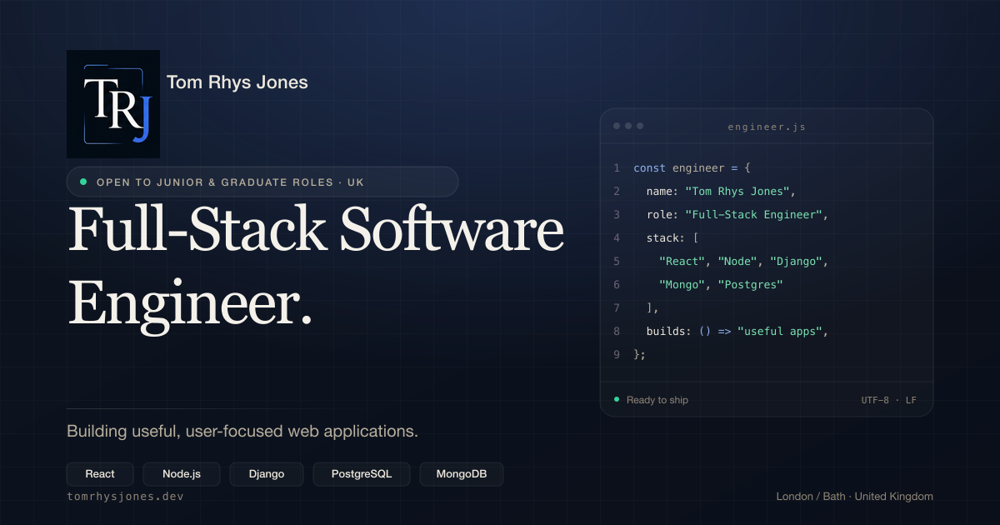

# Tom Rhys Jones — Portfolio

[](https://react.dev/)
[](https://vitejs.dev/)
[](https://tailwindcss.com/)
[](https://www.framer.com/motion/)
[](./LICENSE)

A polished, production-ready personal portfolio for
**Tom Rhys Jones**, a full-stack software engineer based in
London / Bath, UK. Designed for recruiters and hiring
managers considering junior, graduate and entry-level
software engineering roles.

## Screenshot

> _Add a screenshot of the deployed site to
> `public/og-image.png` and it will render here on GitHub._
>
> 

## Technology stack

- **React 19** (JavaScript)
- **Vite 8** — dev server and production build
- **Tailwind CSS 3** — utility-first styling
- **Framer Motion** — restrained, reduced-motion-aware animation
- **Lucide React** — icon set
- **Oxlint** — fast linter

## Features

- Single-page site with sticky, condensing navigation
- Refined dark theme (deep navy, warm off-white, muted blue accent)
- Hero with abstract code-inspired visual (no stock illustrations)
- Structured sections: About, Skills, Projects, Experience, Education, Contact
- Reusable components and data-driven content
- Full keyboard accessibility, skip-link and visible focus states
- Respects `prefers-reduced-motion`
- Lazy-loaded project images with graceful placeholders
- SEO metadata, Open Graph tags, structured data, sitemap and robots.txt
- Ready to deploy to Vercel

## Installation

Requires **Node.js 18+** and **npm 9+**.

```bash
git clone https://github.com/tomrhysjones/tom-rhys-jones-portfolio.git
cd tom-rhys-jones-portfolio
npm install
```

## Development commands

```bash
npm run dev       # Start the Vite dev server (http://localhost:5173)
npm run build     # Build for production into /dist
npm run preview   # Preview the production build locally
npm run lint      # Run Oxlint
```

## Folder structure

```
tom-rhys-jones-portfolio/
├── public/
│   ├── project-images/       # Project screenshots (see the README there)
│   ├── favicon.svg
│   ├── robots.txt
│   ├── sitemap.xml
│   └── Tom-Rhys-Jones-CV.pdf # ← add your CV here
├── src/
│   ├── components/           # Reusable UI (Navbar, Footer, ProjectCard, …)
│   ├── data/                 # Content: projects, skills, experience, config
│   ├── sections/             # Page sections (Hero, About, Skills, …)
│   ├── App.jsx
│   ├── main.jsx
│   └── index.css
├── index.html
├── tailwind.config.js
├── postcss.config.js
├── vite.config.js
└── vercel.json
```

## Customisation

All copy, links and images can be edited without touching component code:

| What you want to change | Where to change it |
| --- | --- |
| Name, title, availability, hero copy | `src/data/siteConfig.js` |
| Email address (see below) | `siteConfig.email` in `src/data/siteConfig.js` |
| Featured projects | `src/data/projects.js` |
| Skills | `src/data/skills.js` |
| Experience timeline | `src/data/experience.js` |
| Education | `src/data/education.js` |
| Navigation items | `src/data/navigation.js` |

### How to add project screenshots

1. Save each screenshot in `public/project-images/` using the
   filenames referenced in `src/data/projects.js`
   (e.g. `setlistlab.png`, `record-shelf.png`, `giglog.png`,
   `ocean-match.png`).
2. Aim for a **16:10** aspect ratio at roughly **1600 × 1000 px**.
3. If a screenshot is missing, the `ProjectImage` component
   renders a polished placeholder card instead — nothing breaks.

See `public/project-images/README.md` for full guidance.

### How to replace the email address

Open `src/data/siteConfig.js` and change **one** value:

```js
export const siteConfig = {
  // ...
  email: 'you@yourdomain.com',
  // ...
};
```

Every `mailto:` link and email button in the site reads from
this single value.

### How to add the CV

1. Export your CV as `Tom-Rhys-Jones-CV.pdf`.
2. Save it at `public/Tom-Rhys-Jones-CV.pdf`.
3. All "Download CV" buttons will then serve the file with the
   correct filename (via the HTML `download` attribute).

If you want to use a different filename, update `siteConfig.cv`.

### Adding a professional headshot (optional)

The hero visual works without a photo. If you want to swap the
code-inspired panel for a headshot, follow the instructions in
the JSDoc block at the top of `src/components/HeroVisual.jsx`.

## Deploy to Vercel

Vercel treats the repository as a standard Vite project. No
extra configuration is needed beyond the provided `vercel.json`.

1. Push the repository to GitHub.
2. Sign in at [vercel.com](https://vercel.com) and click **Add New → Project**.
3. Import the GitHub repository.
4. Framework preset: **Vite**. Build command: `npm run build`.
   Output directory: `dist`.
5. Click **Deploy**.

Every push to `main` will trigger a new production deploy;
pull requests get preview deploys automatically.

To deploy from the terminal instead:

```bash
npm install -g vercel
vercel        # First time — link/create the project
vercel --prod # Deploy to production
```

## Author

**Tom Rhys Jones** — Full-Stack Software Engineer
London / Bath, United Kingdom

- GitHub: [tomrhysjones](https://github.com/tomrhysjones)
- LinkedIn: [tom-rhys-jones](https://www.linkedin.com/in/tom-rhys-jones-63b553209/)

## Licence

Released under the [MIT Licence](./LICENSE).
